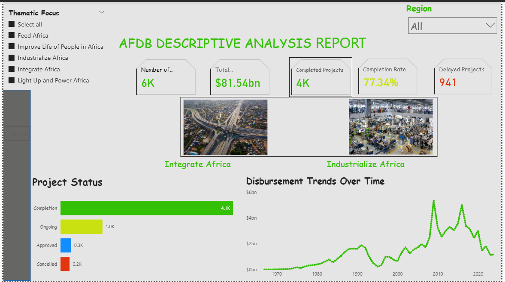

# 🌍 Data-Driven Insights on AfDB “High 5” Portfolio

> Using **Excel** + **Power BI** to analyze African Development Bank (AfDB) project portfolio.  
> Goal: Assess **funding flows**, **delivery performance**, and **delay hotspots** to support **strategic decision-making** in AfDB’s “High 5” priorities.

---

## 🚀 Project Highlights
- ✅ Portfolio scale: **~6,000 projects** with **$81.5bn** in total disbursements  
- ✅ **Completion rate:** **77.3%** of projects  
- ✅ **Delayed projects:** **941** flagged across the portfolio  
- ✅ **Disbursement-to-Commitment ratio:** **49.9%** → significant room to accelerate delivery  
- ✅ Regional **delay hotspots:** Southern Africa (**208 delays**) & West Africa (**206 delays**)  
- ✅ Focus areas analyzed: **Feed Africa; Improve Quality of Life; Industrialize Africa; Integrate Africa; Light Up & Power Africa**

---

## 📊 Dashboard Preview
[🔗 View the interactive dashboard](https://app.powerbi.com/links/lw-4taahVr?ctid=940b29f2-18a4-4aad-9354-e83cbb13f27d&pbi_source=linkShare)

---

## 🛠️ Tools & Tech Stack
  

---

## 📂 Dataset & Methodology
The dataset contained AfDB project portfolio data, including:  
- **Project counts, commitments, disbursements, and completion status**  
- **Regional allocations** (Central, East, North, Southern, West Africa, and “None”)  
- **High 5 themes** for project classification

**Steps taken:**  
- 🔹 **Data Cleaning (Excel):** Standardized region names, cleaned missing values, structured financial figures  
- 🔹 **Data Modeling (Excel):** Built pivot tables and structured data for Power BI ingestion  
- 🔹 **Dashboarding (Power BI):** Designed visuals to show disbursement flows, delays, completion rates, and thematic allocations

---

## 🔎 Key Insights

### 🌍 Regional Funding & High 5 Themes
- **Feed Africa:** Top funding in **West Africa ($6.2bn)** and **North Africa ($5bn)**  
- **Quality of Life:** Largest allocations to **East Africa ($18bn)** and **North Africa ($16.5bn)**  
- **Industrialize Africa & Integrate Africa:** Steady contributions across multiple regions  
- A significant “None” bucket indicates unclassified commitments (~$2.6–4.7bn), highlighting a data attribution gap

### ⏱️ Project Delivery & Delays
- **6,000 projects** in total → **~4,000 completed**, **941 delayed**  
- **Completion rate:** **77.3%**  
- **Delay hotspots:**  
  - Southern Africa (**208 delays**)  
  - West Africa (**206 delays**)  
  - East Africa (**160 delays**)  
- **Average delays:** ~2,000 days for outliers, showing cycle-time challenges

### 📈 Trends
- Disbursements have increased steadily from the early 2000s through the 2020s, showing growing delivery momentum

---

## 📌 Recommendations
1. **Accelerate disbursement conversion:** Improve project cycle efficiency to raise the **49.9% disbursement ratio**  
2. **Tackle delay hotspots:** Focus interventions in **Southern** and **West Africa**  
3. **Strengthen attribution:** Reduce “None” category by ensuring all projects are tagged to a **region & theme**  
4. **Optimize cycle times:** Use milestone tracking and contractor performance monitoring to address **~2,000-day delays**  
5. **Replicate best practices:** Scale up successful delivery models from East & North Africa into lagging regions

---

## ✅ Conclusion
This analysis highlights AfDB’s **large-scale portfolio** and **strong completion rate**, but also pinpoints **delays** and **under-disbursement** as critical challenges. With focused action on hotspots, improved tracking, and stronger execution frameworks, AfDB can accelerate progress on its **High 5 goals** and maximize development impact.

---

### 📎 Notes
- Replace `your-dashboard-screenshot.png` with your actual dashboard image file name.  
- Update any numeric figures to the final values from your Excel workbook if you make further adjustments.  
- If you'd like, I can also generate a small `README` image banner or add themed badges for each of the High 5 priorities.

