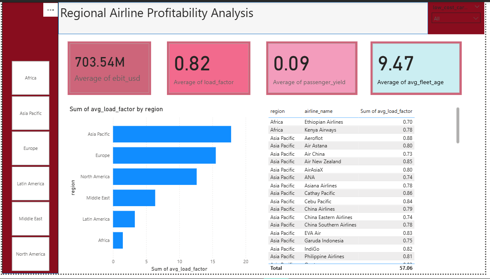

# ✈️ Data-Driven Insights on Regional Airline Profitability  

> Using **SQL** + **Power BI** to analyze airline performance across regions.  
> Goal: Assess profitability, fleet efficiency, passenger yields, and identify trends for **strategic decision-making** in the aviation industry.  

---

## 🚀 Project Highlights  
- ✅ Analyzed **6 global regions** – Africa, Asia-Pacific, Europe, Latin America, Middle East, North America  
- ✅ Average **EBIT (Profitability):** **$703.5M**  
- ✅ Average **Load Factor:** **82%** across airlines  
- ✅ Average **Passenger Yield:** **$0.09 per km**  
- ✅ Average **Fleet Age:** **9.47 years**  
- ✅ Identified **regional performance leaders** in revenue and efficiency  
- ✅ Built an **interactive Power BI dashboard** for airline profitability monitoring  

---

## 📊 Dashboard Preview  
[🔗 View the interactive dashboard](https://app.powerbi.com/links/IBJenMHFr6?ctid=940b29f2-18a4-4aad-9354-e83cbb13f27d&pbi_source=linkShare)  

  

---

## 🛠️ Tools & Tech Stack  
  
  
  

---

## 📂 Dataset & Methodology  
The dataset contained airline profitability and operational metrics across **global regions**.  

**Steps taken:**  
- 🔹 **Data Cleaning (SQL):** Standardized airline names, regions, and numerical values.  
- 🔹 **Data Modeling:** Linked regions, airline performance, yields, fleet age, and EBIT.  
- 🔹 **Dashboarding (Power BI):** Designed visuals to compare profitability, load factors, yields, and efficiency across airlines and regions.  

---

## 🔎 Key Insights  

### 🌍 Regional Profitability  
- **Middle East:** Highest EBIT → **$1.9B** average, strong market dominance.  
- **Asia-Pacific & North America:** Lead in **load factors (81–84%)**, showing high capacity utilization.  
- **Africa:** Passenger yields highest (**$0.11/km**) but EBIT lower (**$554M avg**), signaling cost/revenue balance issues.  

### 👥 Load Factor Trends  
- Global average: **82%**.  
- **North America:** Strongest utilization at **84%**.  
- **Africa:** Lowest at **74%**, reflecting demand and infrastructure challenges.  

### 💰 Passenger Yield Analysis  
- **Top Yield:** Africa (Ethiopian & Kenya Airways at **$0.11/km**).  
- **Lowest Yield:** North America (**$0.07/km**) despite high passenger volume.  

### 🛫 Airline Performance  
- **Profit Leaders:** Delta, United, Qatar Airways, Emirates, Turkish Airlines.  
- **African Spotlight:** Ethiopian Airlines → EBIT **$1.03B** vs Kenya Airways → **$76M**.  
- **Cost-Effective Players:** Qantas, Ryanair, IndiGo with strong EBIT at lower passenger yields.  

### 🏢 Fleet & Airline Age  
- **Global Avg Fleet Age:** ~9.5 years.  
- **Oldest Airlines:** KLM (104 yrs), Qantas (104 yrs), Aeroflot (101 yrs).  
- **Younger Airlines:** AirAsiaX & IndiGo (18 yrs), showing expansion-driven growth.  

---

## 📌 Recommendations  
1. **Africa:** Improve load factors with route optimization & partnerships.  
2. **North America:** Boost passenger yield to balance high capacity utilization.  
3. **Middle East:** Sustain profitability through diversification & competitive pricing.  
4. **Fleet Renewal:** Target older carriers for modernization to cut costs.  
5. **Yield Optimization:** Airlines like Cebu Pacific & AirAsiaX (low yield) should explore ancillary revenue.  

---

## ✅ Conclusion  
This analysis shows how **SQL + Power BI** can uncover **profitability drivers** in global aviation. By comparing EBIT, yields, and fleet efficiency, stakeholders can identify where airlines excel and where interventions are needed. The insights empower decision-makers to **optimize operations, improve yields, and sustain profitability across regions**.  

---
