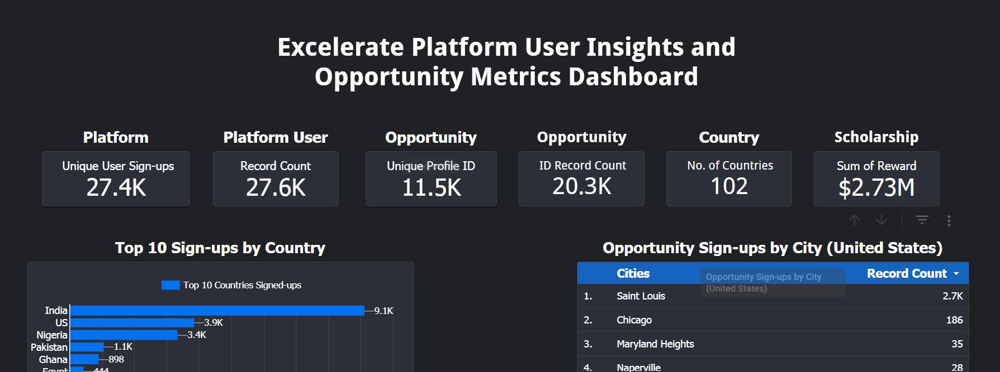
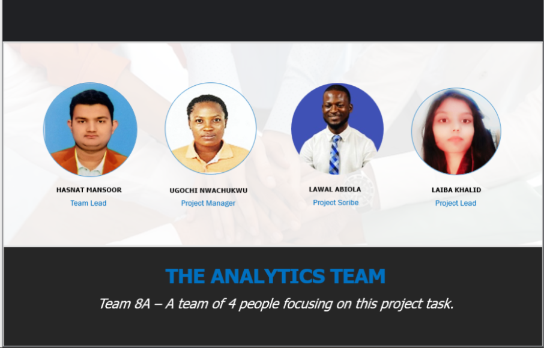

# Excelerate Platform Analytics

This project provides a comprehensive analysis of user engagement and opportunity participation on the **Excelerate Platform**.  
It leverages data on sign-ups, demographics, skills gained, and rewards to evaluate platform growth, opportunity metrics, and user outcomes.

📊 Interactive Dashboard: [View Report](https://lookerstudio.google.com/s/rjS5WYGl79k)

---

## 🖼️ Report Snapshot
  
*Figure: Excelerate Platform User Insights Dashboard*

---

## 📌 Project Overview
The analysis focuses on:
- Tracking unique user sign-ups across 102 countries
- Measuring opportunity sign-ups (internships, courses, events, competitions, scholarships)
- Understanding demographic distribution (gender, education level, location)
- Evaluating rewards, scholarships, and completion rates
- Identifying trends in skills gained (e.g., critical thinking, collaboration, communication)
- Providing strategic recommendations for growth

---

## 📈 Key Insights
- **27.6K+** unique user sign-ups, with India, the US, and Nigeria leading.
- **20.3K+** opportunities applied to, with internships being the most popular.
- Over **$2.7M** in rewards and scholarships awarded.
- Female users represent the majority of sign-ups (60%).
- Most common skills earned: *Critical Thinking, Collaboration, Communication*.
- Completion rates vary by gender and opportunity type.

---

## 🛠️ Teams Involved
This project was delivered through cross-functional collaboration:

- **Analytics Team** → Data collection, cleaning, and dashboard design.  
- **Research Team** → User demographics and opportunity mapping.  
- **Engagement Team** → Tracking campaigns, sign-ups, and social media outreach.  
- **Rewards & Programs Team** → Scholarship and reward allocation tracking.  
- **Excelerate Core Team** → Project coordination and stakeholder engagement.  

---

## 👥 Team Photo
  
*Figure: The Excelerate Analytics & Engagement Teams*

---

## 🚀 Recommendations
- **Increase Campaign Reach** → Expand digital campaigns to boost sign-ups.  
- **Follow-up & Motivation** → Improve user engagement through reminders and nudges.  
- **Self-paced Internship Methodology** → Enhance flexibility for participants to improve completion rates.  

---

---

## 🙏 Acknowledgements
Special thanks to the **Excelerate Team** and all contributors who supported this project with data, insights, and recommendations.  

